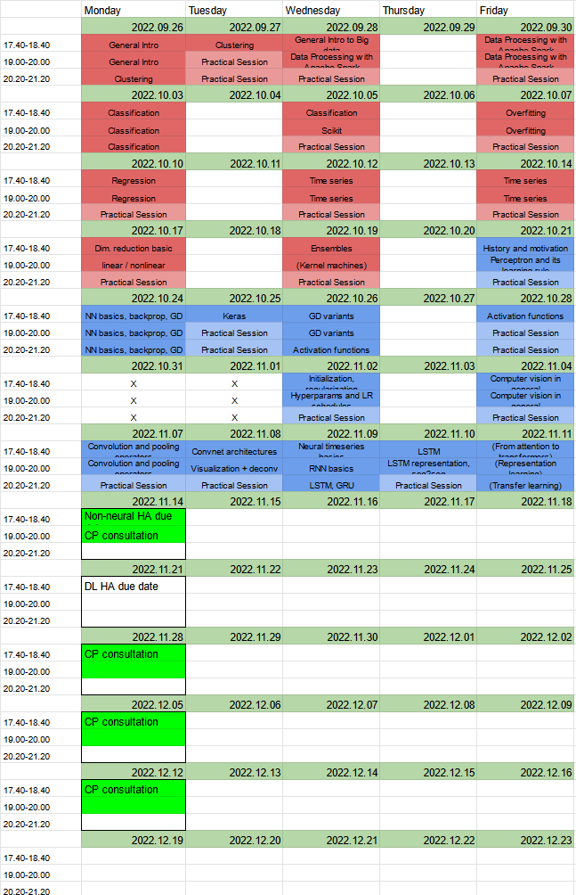

# MIB Non-Neural Machine Learning
***
Main repository for non-neural machine learning class. I will be uploading all of the materials we get into this repository to create a more comprehensive view.

Libraries that you're going to need:
```zsh
pip3 install numpy pandas matplotlib sklearn tensorflow cv2-python yfinance
```

## Link to videos
| Session | Date       | Day of date      |Summary |
|---------|------------|------------------|--------|
| 1       | 26.09.2022 | Monday|[Theoritical lecture, Clustering and centroids](https://www.youtube.com/watch?v=pubHlnOgNMc)  |
| 2       | 27.09.2022 | Tuesday|[Practise , scaling fitting kmeans](https://www.youtube.com/watch?v=nseEWZKazq0)             |
| 3       | 28.09.2022 | Wednesday|[Big Data / Databricks](https://www.youtube.com/watch?v=bcNsZh2joi8)                       |
| 4       | 30.09.2022 | Friday|[Big Data / Databricks](https://www.youtube.com/watch?v=zKcw12nz5pE)                          |
| 5       | 03.10.2022 | Monday|[Classification](https://www.youtube.com/watch?v=4207o7IyCUc)                                 |
| 6       | 05.10.2022 | Wednesday|[Classification](https://www.youtube.com/watch?v=d9Pf4t9WK5M)                              |
| 7       | 07.10.2022 | Friday|[Regression / Overfitting](https://www.youtube.com/watch?v=RItnh8IhBg8)                       |
| 8       | 10.10.2022 | Monday |[Regression / Overfitting](https://www.youtube.com/watch?v=LD0G_tTmZzo)                      |
| 9       | 12.10.2022 | Wednesday |[Time Series](https://www.youtube.com/watch?v=RuvXhDgo-xM)                                |
| 10      | 14.10.2022 | Friday|[Time Series](https://www.youtube.com/watch?v=O-GNPaHmXqY)                                    |
| 11      | 17.10.2022 | Monday|[Dimensional Reducation](https://www.youtube.com/watch?v=H6bRYhng6WY)                         |
| 12      | 19.10.2022 | Wednesday|[Kernel machines / Ensemble learning](https://www.youtube.com/watch?v=06hD6_JGSr4)         |
| 13      | 21.10.2022 | Friday|[Perceptron](https://www.youtube.com/watch?v=Y0wmMaoBA3Y)                                                        |
| 14      | 24.10.2022 | Monday|[Neural Networks, Basic gradient descent](https://www.youtube.com/watch?v=k01K-vwyjNs)                           |
| 15      | 25.10.2022 | Tuesday|[Gradient descent variant, Activation](https://www.youtube.com/watch?v=EJDxY87q56M)                             |
| 16      | 26.10.2022 | Wednesday|[Regularization, hyperparameters](https://www.youtube.com/watch?v=umrsECiWuB0)                                |
| 17      | 28.10.2022 | Friday|[Computer Vision, CNN]()                                              |
| 18      | 02.11.2022 | Wednesday|[RNN, LSTM]()                                                      |
| 19      | 04.11.2022 | Friday|[Seq2seq, Bahdanau, Transformers]()                                   |
| 20      | 07.11.2022 | Monday|[Seq2seq, Bahdanau, Transformers]()                                   |
| 21      | 08.11.2022 | Tuesday|[Seq2seq, Bahdanau, Transformers]()                                   |
| 22      | 09.11.2022 | Wednesday|[]()                                   |
| 23      | 10.11.2022 | Thursday|[Representation learning, Transfer learning, Reinforcement learning]()                                   |
| 24      | 11.11.2022 | Friday|[Representation learning, Transfer learning, Reinforcement learning]()                                   |
| 25      | 14.11.2022 | Monday|[Capstone Project Consultation]()                                     |

### Other interesting links

https://learn.microsoft.com/en-us/devops/plan/what-is-agile-development

https://www.youtube.com/watch?v=lWPiSZf7-uQ&t=2131

## Timetable


## Detailed Timetable
